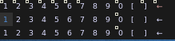
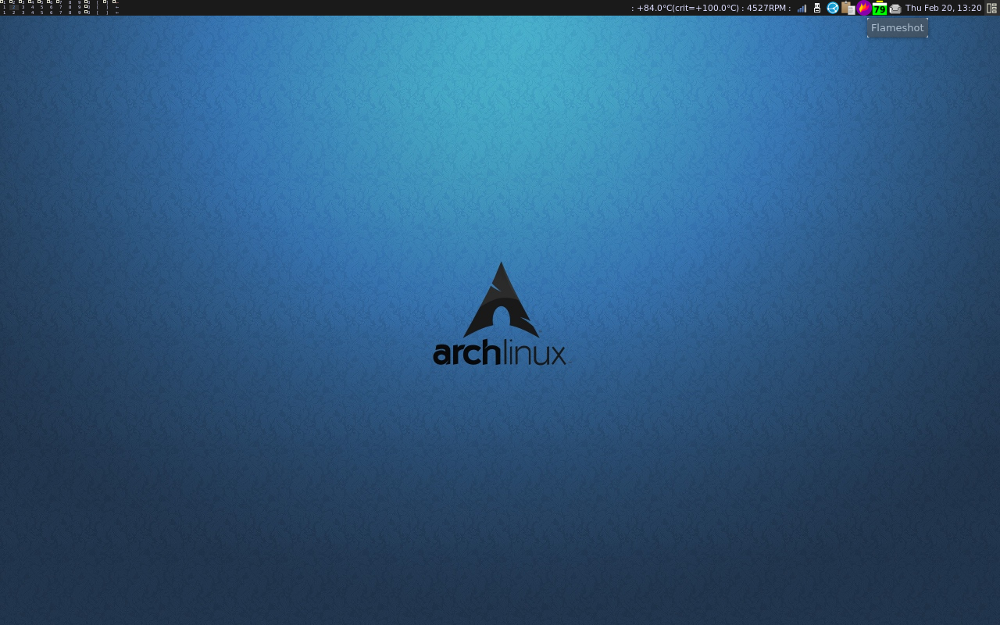

# Extension providing a grid layout for awesomeWM 4.3

awesomeWM <https://github.com/awesomeWM/awesome>

## Installation

Clone this repo, for ease of use in the same folder where `rc.lua` is.

Add something like:

``` lua
-- Include taggrid, a m x n grid of tags
taggrid = require("taggrid.taggrid")
taggridkeys = require("taggrid.taggridkeys")
```

Below the awesome libraries but nearby the top of `rc.lua`.

Comment and replace `awful.tag()` like this:

``` lua
-- Each screen has its own tag table.
--awful.tag({ "1", "2", "3", "4", "5", "6", "7", "8", "9" }, s, awful.layout.layouts[1])

-- Replace the tag setup with the one provided from taggrid
awful.tag(taggrid.tags, s, awful.layout.layouts[1])
```

And provide the `gridlayout` for the `taglist`:

``` lua
-- Create a taglist widget
-- using the gridlayout from taggrid
s.mytaglist = awful.widget.taglist{
  screen = s,
  filter = awful.widget.taglist.filter.all,
  buttons = taglist_buttons,
  layout = taggrid.gridlayout
}
```

## Keybindings

Most of the keybindings will be imported from `taggridkeys` but `viewprev` and  `viewnext`
will be changed in-place.

Change to the following if wrapping around on the same row is desirable:

``` lua
    awful.key({ modkey,           }, "Left",  taggrid.viewprev, --awful.tag.viewprev
              {description = "view previous", group = "tag"}),
    awful.key({ modkey,           }, "Right",  taggrid.viewnext, --awful.tag.viewnext
              {description = "view next", group = "tag"}),
```

The last modification is to fully replace the number key bindings:

``` lua

-- Replaced by taggrid

-- @DOC_NUMBER_KEYBINDINGS@
-- Bind all key numbers to tags.
-- Be careful: we use keycodes to make it work on any keyboard layout.
-- This should map on the top row of your keyboard, usually 1 to 9.
--for i = 1, 9 do
    --globalkeys = gears.table.join(globalkeys,
        ---- View tag only.
        --awful.key({ modkey }, "#" .. i + 9,
                  --function ()
                        --local screen = awful.screen.focused()
                        --local tag = screen.tags[i]
                        --if tag then
                           --tag:view_only()
                        --end
                  --end,
                  --{description = "view tag #"..i, group = "tag"}),
        ---- Toggle tag display.
        --awful.key({ modkey, "Control" }, "#" .. i + 9,
                  --function ()
                      --local screen = awful.screen.focused()
                      --local tag = screen.tags[i]
                      --if tag then
                         --awful.tag.viewtoggle(tag)
                      --end
                  --end,
                  --{description = "toggle tag #" .. i, group = "tag"}),
        ---- Move client to tag.
        --awful.key({ modkey, "Shift" }, "#" .. i + 9,
                  --function ()
                      --if client.focus then
                          --local tag = client.focus.screen.tags[i]
                          --if tag then
                              --client.focus:move_to_tag(tag)
                          --end
                     --end
                  --end,
                  --{description = "move focused client to tag #"..i, group = "tag"}),
        ---- Toggle tag on focused client.
        --awful.key({ modkey, "Control", "Shift" }, "#" .. i + 9,
                  --function ()
                      --if client.focus then
                          --local tag = client.focus.screen.tags[i]
                          --if tag then
                              --client.focus:toggle_tag(tag)
                          --end
                      --end
                  --end,
                  --{description = "toggle focused client on tag #" .. i, group = "tag"})
    --)
--end

-- Setup taggridkeys, keybindings for the mxn grid of tags
globalkeys = taggridkeys(globalkeys)
```

## Styling/looks

Useful properties for tuning the size:

``` lua
theme.taglist_font                  = "Terminus 4"
-- Not needed, will autoadjust to content
--theme.wibar_height                  = 30
```

## Example

Scaled up on a low resolution 1280x800 screen, wibar_height = 50, "Terminus 7":



On the same screen (12") running with taglist_font = "Terminus 4":



## Usage

Awesome use the keycodes directly, so the whole number row, from number 1 to 9 continuing towards the backspace key on my Swedish keyboard.

This provides direct access to 13 tags.

```
Modkey + (1 to 9), Modkey + 0, Modkey + [, Modkey + ], Modkey + "Backspace"
```

The same modifiers as in stock awesome for toggling views and tags.

Supports moving between tags in all directions:

```
Modkey + ArrowKeys(Up, Down, Left, Right)
Modkey + <
Modkey + >
```

Add "Shift" for shifting the currently focused client.

Scrolling on the tagbar will cycle through all tags, using the movement keys it will wrap around on the current row. Similar behaviour for shifting clients.

See `taggridkeys.lua` for more details.